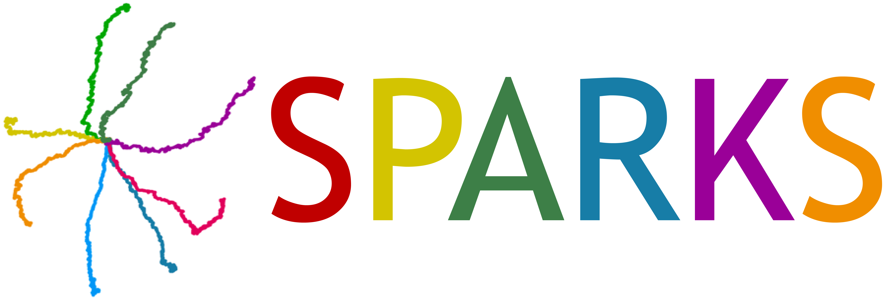

[📚Documentation](https://sparks.crick.ac.uk/docs#) |
[💡DEMOS](https://sparks.crick.ac.uk/demos#) |
[🛠️ Installation](https://sparks.crick.ac.uk/docs#) |
[🌎 Home Page](https://sparks.crick.ac.uk/) |
[🪲 Reporting Issues](https://github.com/FrancisCrickInstitute/sparks/issues)

# SPARKS 🎆

This is the official repository for **SPARKS**: a **S**equential **P**redictive **A**utoencoder for the **A**nalysis of **S**pi**K**ing **S**ignals. 

SPARKS includes a novel self-attention mechanism using Hebbian learning to generate reliable latent representations from single spike timings. SPARKS trains a variational autoencoder with a novel criterion inspired by predictive coding for temporal coherence.

``sparks`` is implemented in [PyTorch](https://pytorch.org/) and includes [demos](https://github.com/FrancisCrickInstitute/SPARKS/sparks/scripts) for a quickstart.
It can perform supervised or unsupervised to produce low-dimensional latent embeddings which allows to gain biological insights from neural data.

Make sure to 👀 watch or ⭐️ star this repository to keep updated!

# Reference

- 📄 **Preprint**:

**Coming soon!**

# License
- SPARKS is an open source software under a GLPv3 license.
